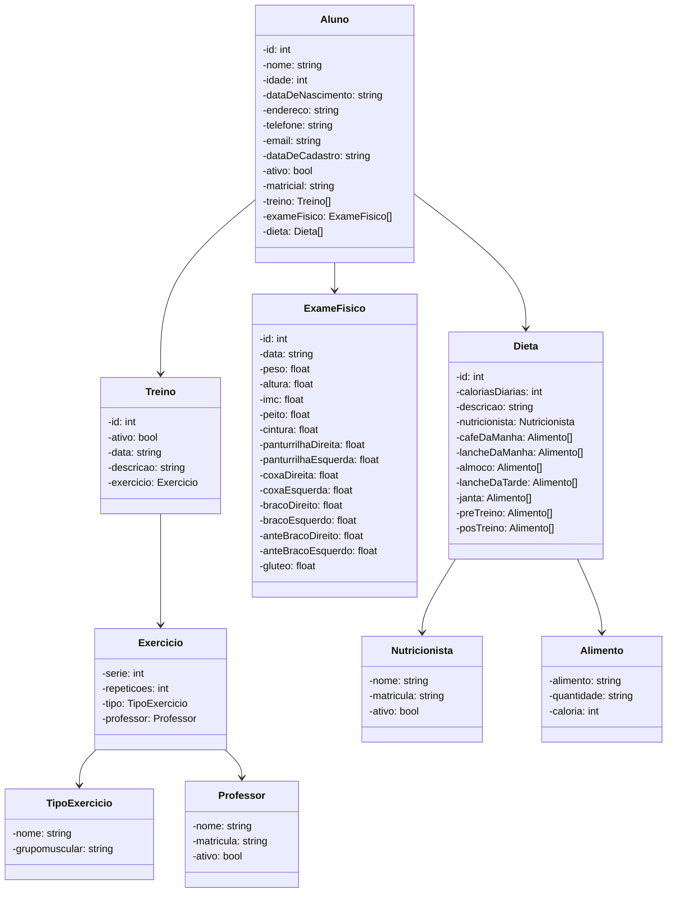

# Academia
## Diagrama de classes

```mermaid
classDiagram
    class Aluno {
        -id: int
        -nome: string
        -idade: int
        -dataDeNascimento: string
        -endereco: string
        -telefone: string
        -email: string
        -dataDeCadastro: string
        -ativo: bool
        -matricial: string
        -treino: Treino[]
        -exameFisico: ExameFisico[]
        -dieta: Dieta[]
    }

    class Treino {
        -id: int
        -ativo: bool
        -data: string
        -descricao: string
        -exercicio: Exercicio
    }

    class Exercicio {
        -serie: int
        -repeticoes: int
        -tipo: TipoExercicio
        -professor: Professor
    }

    class TipoExercicio {
        -nome: string
        -grupomuscular: string
    }

    class Professor {
        -nome: string
        -matricula: string
        -ativo: bool
    }

    class ExameFisico {
        -id: int
        -data: string
        -peso: float
        -altura: float
        -imc: float
        -peito: float
        -cintura: float
        -panturrilhaDireita: float
        -panturrilhaEsquerda: float
        -coxaDireita: float
        -coxaEsquerda: float
        -bracoDireito: float
        -bracoEsquerdo: float
        -anteBracoDireito: float
        -anteBracoEsquerdo: float
        -gluteo: float
    }

    class Dieta {
        -id: int
        -caloriasDiarias: int
        -descricao: string
        -nutricionista: Nutricionista
        -cafeDaManha: Alimento[]
        -lancheDaManha: Alimento[]
        -almoco: Alimento[]
        -lancheDaTarde: Alimento[]
        -janta: Alimento[]
        -preTreino: Alimento[]
        -posTreino: Alimento[]
    }

    class Nutricionista {
        -nome: string
        -matricula: string
        -ativo: bool
    }

    class Alimento {
        -alimento: string
        -quantidade: string
        -caloria: int
    }

    Aluno --> Treino
    Aluno --> ExameFisico
    Aluno --> Dieta
    Treino --> Exercicio
    Exercicio --> TipoExercicio
    Exercicio --> Professor
    Dieta --> Nutricionista
    Dieta --> Alimento

```
